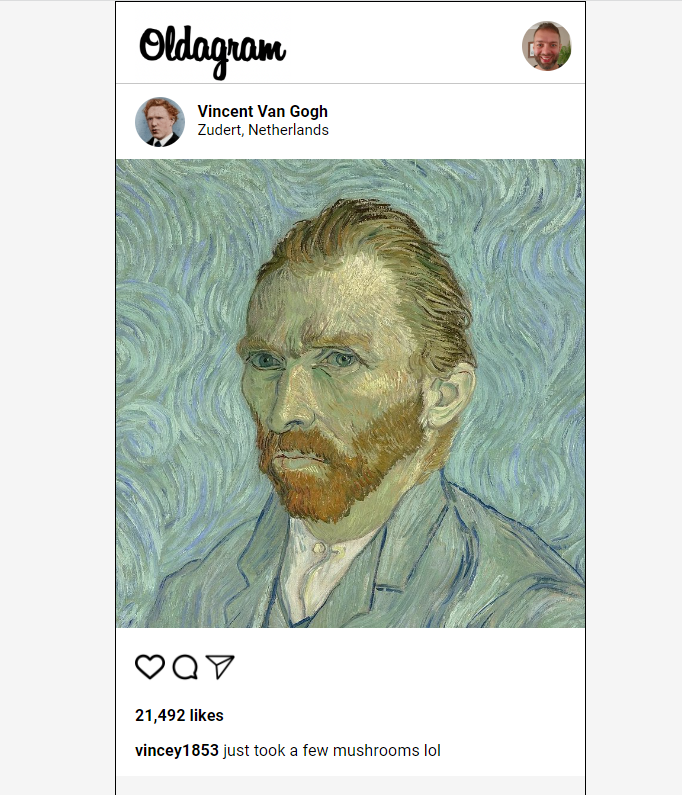

# Scrimba - Oldagram App

This is a solution to the Frontend Developer Career Path module 3 - Oldagram App - on Scrimba [Frontend Career Path](https://scrimba.com/learn/frontend)

The aim of this project was to create an Instagram clone using JavaScript, CSS and HTML.
## Requirements
#### - Create from scratch
#### - Use semantic HTML
#### - Add hover effects to the icons
#### - Make teh design look like an example on Fimba files
#### - Increase the likes when clicking the post
#### - Decrease likes when double cliking on the post

## Links

- Solution URL: [https://github.com/Rocky-MPN/Frontend/tree/main/Scrimba/Oldagram](https://github.com/Rocky-MPN/Frontend/tree/main/Scrimba/Oldagram)
- Live Site URL: [https://rocky-mpn.github.io/Endorsement-App/](https://rocky-mpn.github.io/Oldagram/)

##Screenshot

