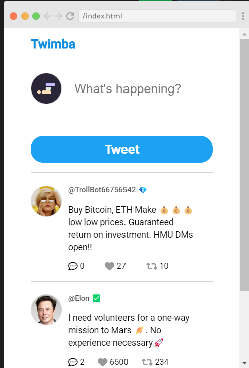

# Scrimba - Twitter Clone

This is a solution to the Frontend Developer Career Path module 5 - Twitter Clone App - on Scrimba [Frontend Career Path](https://scrimba.com/learn/frontend)

The aim of this project was to create a twitter clone using JavaScript, CSS and HTML.
## Requirements
#### - User can like and unlike tweets
#### - User can tweet a new tweet
#### - A new tweet shoudl appear on teh top of the feed
#### - If there are replies, user should be able to open and see replies

## Links

- Solution URL: [https://github.com/Rocky-MPN/Frontend/tree/main/Scrimba/Twitter-Clone](https://github.com/Rocky-MPN/Frontend/tree/main/Scrimba/Twitter-Clone)
- Live Site URL: [https://rocky-mpn.github.io/Twitter-Clone/](https://rocky-mpn.github.io/Twitter-Clone/)

##Screenshot

